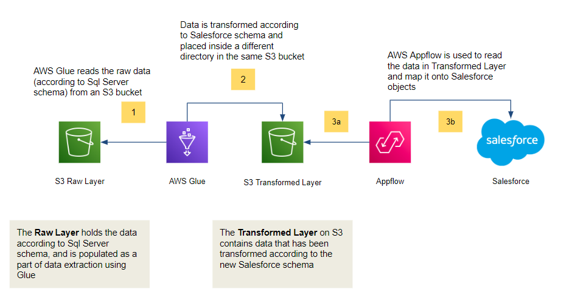

# Design and Implementation
1. AWS Glue reads the raw data (according to Sql Server schema) from an S3 bucket
2. Data is transformed according to Salesforce schema and placed inside a different directory in the same S3 bucket
3. Data is converted from Parquet to JSON lines format as Appflow accepts either CSV files or JSON lines format. Since CSV files cannot hold type data type information therefore JSON format is used
4. A template is created for creating a flow in Appflow using Infrastructure as Code (IaC) using boto3 
5. UPSERT logic is implemented in the flow design to ensure no duplications at Salesforce object level
6. AWS Appflow flow created above is used to read the JSON version of Parquet data in Transformed Layer and map it onto Salesforce objects 

The architecture diagram attached below explains the design and working of the implementation pictorially 

  

